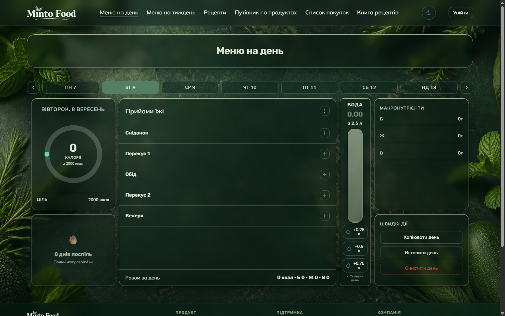
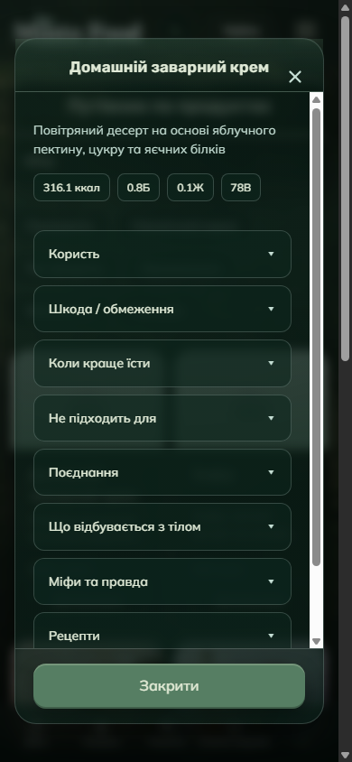
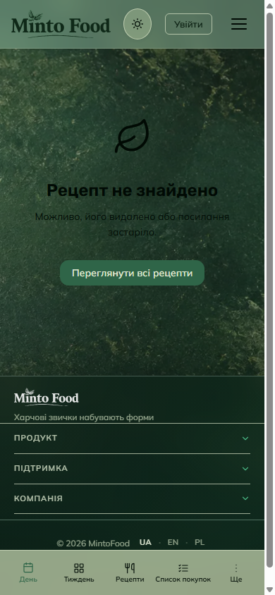

# Фаза 22 — локальний QA, 08.09.2026

Локальний гостьовий прохід завершено. Фаза 22 загалом залишається відкритою: авторизовані сценарії, повна модерація, реальні пристрої та soft launch цим прогоном не покриті.

## Середовище й докази

- Виконавець: Codex. Базовий commit: `0218bb5` + описані нижче локальні виправлення; нового deployment немає.
- Windows, встановлений Chrome `152.0.7977.83`, headless, свіжа гостьова сесія. Розміри viewport емульовані; це не Safari/реальний телефон.
- Локальний HTTP-сервер на `127.0.0.1` з CSP із `vercel.json`; точні тимчасові origins і UTC-час кожного запуску збережені в [evidence.json](evidence.json).
- Локальні API-функції не виконувались. Для браузерних запитів дозволено GET/HEAD/OPTIONS; запити запису блокуються. Серверні дані не змінювались, тестові акаунти не створювались.
- У матриці заздалегідь заданий чинний guest cookie choice з analytics/marketing=false. Вона не доводить правильність consent UI чи роботи PostHog з реальним ключем.
- Повні скриншоти й початкові JSON-звіти: `node_modules/.cache/phase22-ui/<artifactDirectory>/`; ідентифікатори каталогів є в evidence.json. Chrome та локальні сервери після прогонів завершено; тимчасові профілі лишились у Git-ignored cache.

## Результати

| Перевірка | Результат | Межі висновку |
|---|---|---|
| API lint | PASS | `npm run lint:api`, наявний gate `no-undef` |
| Збереження рецептів | 30/30 PASS | Мок-тести, не живі транзакції/права БД |
| Consent gate | 12/12 PASS | Мок-тести, без реального PostHog |
| GDPR cron | 4/4 PASS | Мок-тести, справжній hard-delete не запускався |
| Admin security | 22/22 PASS | Наявна локальна test suite |
| Admin lint/build | PASS | Production build, 24/24 static pages |
| Root build | PASS | HTML: `0 updated`; Sass компілюється |
| CSP/theme smoke | 10/10 сторінок PASS | Існуючий `scripts/csp-theme-check.mjs`, включно з rewrite рецепта |
| Основна UI-матриця | 68/68 PASS | 17 сторінок × 2 теми × 1440×900 / 390×844, початкові гостьові стани |
| Проміжні ширини | 136/136 PASS | Ті самі сторінки й теми × 1200/1024/768/480, висота 900 |
| `/recipe/nonexistent-slug` | 4/4 PASS | Локальний rewrite, стан «Рецепт не знайдено», ресурси/тема/layout |
| Гостьовий доступ до живої адмінки | PASS | `/dashboard` і `/moderation` → `307 /login`, без cookie/токена |
| Інтерактивний UI | PARTIAL | Успішні дії й відкриті дефекти нижче |
| Путівник з даними | PARTIAL | Пошук/модалка працюють; три відсутні зображення |

17 сторінок: `index`, `week-menu`, `recipes`, `recipe`, `product-guide`, `shopping-list`, `shared-list`, `cookbook`, `profile`, `privacy`, `terms`, `cookies`, `imprint`, `dmca`, `404`, `500`, `maintenance`.

У 204 фінальних початкових станах: немає горизонтального переповнення document, uncaught/console errors, failed resources, битих видимих images або вкладених/зайвих main; тема відповідає заданій, `no-transition` прибраний. Футер доходить до нижньої межі з урахуванням 64 px, зарезервованих під мобільну навігацію. Це перевірка геометрії та початкових станів, а не доказ доступності кожного елемента чи всіх станів застосунку.

Вибірково оглянуто screenshots: index desktop у двох темах і на 1024 px, recipes dark desktop і light 480 px, profile light mobile, cookbook light desktop, privacy light 768 px, recipe-not-found light mobile, 500 dark mobile, product modal dark mobile. Візуальну примітку щодо читабельності наведено нижче.

## Виправлено локально

### QA22-FIX-01 — секції профілю відображались попри hidden

До виправлення всі п'ять `data-profile-section` мали видиму геометрію навіть для гостя; чотири з них уже мали HTML-атрибут `hidden`. Відтворено в обох темах на 1440/390 px, докази: `profileBefore` у evidence.json.

Причина: авторські `display:flex`/`display:grid` перекривали стандартне приховування браузера. У `scss/pages/_profile.scss` додано `[data-profile-section][hidden] { display: none; }`, CSS та source map перебудовані. Після виправлення видима тільки початкова секція, решта чотири приховані в усіх 12 комбінаціях теми/ширини. Ініціалізацію авторизованого профілю не змінено.

### QA22-FIX-02 — хедер не позначав поточну сторінку

`js/mobile-nav.js` порівнював `index.html` з `/index.html`; жоден пункт хедера не отримував active class. Перед порівнянням тепер береться останній сегмент href, як і для поточного URL. Призначення посилань та склад меню збережені.

Фінальний прохід підтвердив active class для всіх шести відповідних пунктів меню на всіх перевірених ширинах/темах.



## Перевірені взаємодії

На `index` і `terms`, у двох темах на desktop/mobile:

- перемикання теми в обидва боки — PASS;
- відкриття входу з хедера, закриття хрестиком — PASS;
- мобільний burger: відкриття й закриття через Esc — PASS;
- «Ще» на головній: відкриття/закриття через Esc; admin link прихований для гостя — PASS;
- мобільний акордеон футера — PASS;
- back-to-top на довгій сторінці terms, обидві теми — PASS;
- реальна браузерна емуляція offline/online викликає відповідні банери — PASS. Автоматичне зникнення recovery-банера не перевірялось.

Пошук путівника перевірено після завершення завантаження `products`. Запит `яблу` показав 5 карток; відкриття й закриття першого результату — PASS в обох темах на desktop/mobile. Перший короткий прогін із `яблуко` не дав результатів і не використаний як доказ дефекту пошуку. Нуль карток у початковій матриці відповідає welcome-стану: путівник навмисно не показує каталог до пошуку/фільтра.

## Відкриті дефекти

### QA22-01 — клавіатура в модалці входу (UI-09)

**FAIL**, відтворено 8/8: index/terms × дві теми × desktop/mobile.

Кроки: натиснути «Увійти» в хедері → перевірити activeElement → натиснути Esc. Модалка відкривається, але фокус лишається на посиланні за нею; Esc модалку не закриває. Хрестик працює. Відповідні поля `authFocusInside=false`, `authEscape=false` є у `runs.interactions`.

Наступна дія: погодити поведінку клавіатури (початковий фокус, утримання/повернення фокусу, Esc), після цього реалізувати та перевірити. Нову поведінку auth UI у цьому проході не вводили; це рішення власниці продукту за AGENTS.md.

### QA22-02 — відсутні фото продуктів (PROD-03 / UI-10)

**FAIL**, повторено в обох темах і viewport. Пошук та відкриття першого результату дають `net::ERR_BLOCKED_BY_ORB` для трьох об'єктів публічного bucket `product-images`:

- `Zefir.jpg`;
- `Custard pastila.jpg`;
- `Homemade custard.jpg`.

Окремі read-only GET підтвердили для всіх трьох HTTP `400`, `Content-Type: application/json`, тіло `{"statusCode":"404","error":"not_found","message":"Object not found","code":"NoSuchKey"}`. У браузері це помилки ресурсів; загального падіння сторінки немає.

Наступна дія: власниця даних визначає правильні фото; відновити об'єкти або погодити виправлення посилань у БД. Завантаження/заміни фото та зміни БД не виконувались.



### QA22-03 — візуальна примітка: стан recipe-not-found у світлій темі

Чорний заголовок і пояснення розташовані безпосередньо на темному текстурному фоні, через що читабельність нижча, ніж у сусідніх картках. Це візуальне спостереження, не виміряний WCAG contrast score. Дизайн/кольори не змінювались; потрібне рішення щодо оформлення цього стану.



## Попередження інструментів

- Root build має відомі Sass deprecation warnings щодо `@import`/`darken`; збірку вони не блокують. Build виконує compressed CSS згідно з package.json, тому змінює формат tracked CSS. Для локального diff збережено звичайний expanded формат після `npm run build:css`.
- Admin build попереджає про inferred workspace root через два lock-файли; компіляція й TypeScript завершились успішно. Конфігурацію монорепозиторію не змінено.
- У пісочниці існуючий CSP/theme script не відкрив Chrome CDP port; поза нею той самий script пройшов. Історичну причину зависання 01.08 цим не доведено.
- Вбудований Browser був недоступний через `missing field sandboxPolicy`; після спроби штатного підключення використано встановлений Chrome. Нових пакетів не встановлено.
- Початкова перевірка футера дала 4 хибні спрацювання, бо не враховувала мобільний body padding. Уточнено саме перевірку, а не layout; фінальний повтор 68/68 успішний.

## Залишилося для всієї фази 22

- Авторизовані меню/профіль/книги та регрес BOOK-06/07 з реальним logout.
- Адмінські workflow: pagination/approve/reject/staged/bulk/ban та runtime-захист під non-admin сесією.
- iOS Safari, Android Chrome, iPad Safari, macOS Safari; touch, клавіатура телефона, safe areas.
- Повний keyboard/focus/contrast audit, populated recipes/cookbooks, стани помилок і довгі дії; збереження/видалення даних не тестувались.
- GDPR/consent/PostHog/Sentry з реальними інтеграціями за відповідними QA rounds.
- Soft launch 20–50 людей, два тижні спостереження та crash rate.

## Повторення

```powershell
node scripts/csp-theme-check.mjs
node scripts/phase22-ui-check.mjs
node scripts/phase22-ui-check.mjs --breakpoints
node scripts/phase22-ui-check.mjs --pages=index,terms,product-guide --interactions
node scripts/phase22-ui-check.mjs --pages=recipe-route
```

Використовується встановлений Chrome (`CHROME_PATH` за потреби). Інтерактивний прогін очікувано повертає exit code 1, доки відкриті QA22-01/02. Непідтверджені populated checks вказуються окремо як `blockedChecks`, а не як PASS поведінки з даними.
